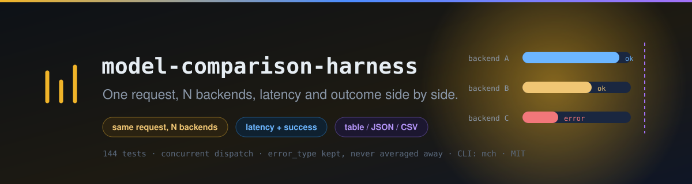
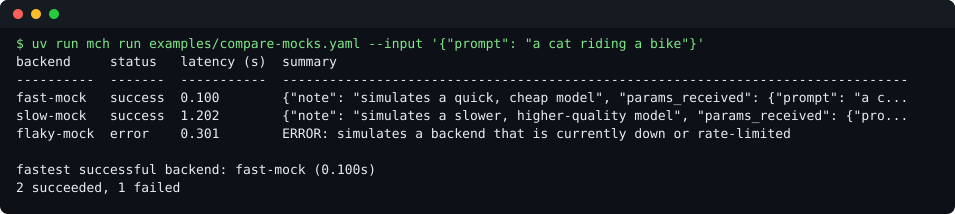
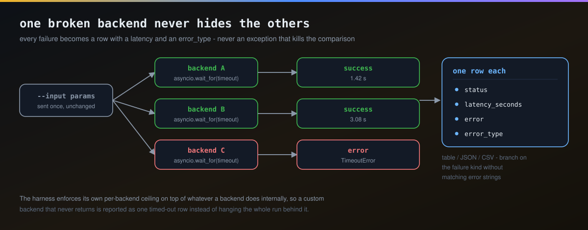
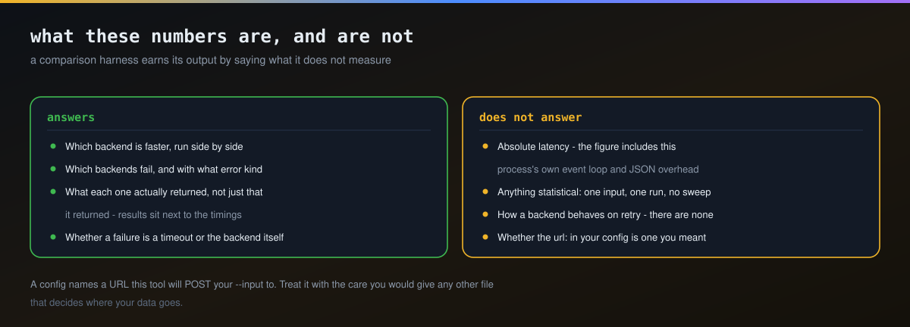

# model-comparison-harness

Run the same request against multiple generative-model backends **concurrently** and compare latency, success/failure, and results side by side — a small CLI (`mch`) for the "which model should this capability actually route to" question.



<sub>Real output of the Quick start command below, rendered by <code>arac/terminal-goruntusu.py</code>.</sub>

This extends the same lesson [`nvidia-nim-mcp`](https://github.com/Furkiozknn/nvidia-nim-mcp) already lives by (try more than one model, don't trust any single one to stay fast/available/alive) into an explicit, on-demand comparison tool: point it at N backends, fire the same input at all of them at once, see exactly how they stack up.

It's part of a small ecosystem of focused repos for an AI creative platform — one of its backend types (`gateway`) speaks the same submit/poll HTTP contract as [`ai-job-gateway`](https://github.com/Furkiozknn/ai-job-gateway), so you can compare a mock/local model against a real one running behind that gateway with no code, just YAML.

## Quick start

Needs Python 3.11+ and [uv](https://docs.astral.sh/uv/getting-started/installation/). The shipped example uses `mock` backends only, so this runs offline with no API key:

```bash
git clone https://github.com/Furkiozknn/model-comparison-harness.git
cd model-comparison-harness
uv sync
uv run mch run examples/compare-mocks.yaml --input '{"prompt": "a cat riding a bike"}'
```

```
backend     status   latency (s)  summary
----------  -------  -----------  --------------------------------------------------------------------------------
fast-mock   success  0.100        {"note": "simulates a quick, cheap model", "params_received": {"prompt": "a c...
slow-mock   success  1.202        {"note": "simulates a slower, higher-quality model", "params_received": {"pro...
flaky-mock  error    0.301        ERROR: simulates a backend that is currently down or rate-limited

fastest successful backend: fast-mock (0.100s)
2 succeeded, 1 failed
```

Latencies vary by a millisecond or so from run to run. That config is three mock backends:

```yaml
# examples/compare-mocks.yaml
backends:
  - name: fast-mock
    type: mock
    delay: 0.1
    result:
      note: "simulates a quick, cheap model"

  - name: slow-mock
    type: mock
    delay: 1.2
    result:
      note: "simulates a slower, higher-quality model"

  - name: flaky-mock
    type: mock
    delay: 0.3
    should_fail: true
    failure_message: "simulates a backend that is currently down or rate-limited"
```

One backend erroring never hides the other results — the whole point is seeing every backend's outcome side by side, including the failures. The same goes for a backend that just *hangs*: pass `--timeout SECONDS` and a backend that exceeds it is reported as a timeout error instead of blocking every other backend's result forever (see "The CLI" below).

## Backend types



| Type | What it does | Required fields | Optional fields (default) |
|---|---|---|---|
| `mock` | Configurable delay + fixed (or forced-failing) result. Zero network, zero dependencies — for tests, demos, and dry-running a config's shape. | — | `delay` (0.05), `result`, `should_fail` (false), `failure_message` |
| `gateway` | `POST /v1/{capability}` + poll, the same submit/poll contract [`ai-job-gateway`](https://github.com/Furkiozknn/ai-job-gateway) implements. Works against any server implementing that same shape, not only that specific repo. The `polling_url` the server returns must be a path on the configured host and port; anything else is an error, not a request. | `url`, `capability` | `timeout` (60), `poll_interval` (0.3), `max_response_bytes` (10485760) |
| `http` | The simplest real-world case: `POST` params to a fixed URL, treat the JSON response body as the result directly — no submit/poll assumed. Fits any synchronous request/response API. Redirects are reported as errors, not followed; a body over `max_response_bytes` is cut off and reported. | `url` | `headers`, `timeout` (60), `max_response_bytes` (10485760) |

Every backend also takes `name` (unique) and `type`. `mch validate` checks each field's type and range and rejects unknown fields, so a typo like `dealy: 3` is an error with a "did you mean 'delay'?" hint instead of a silently ignored line. `url` must be an absolute `http://` or `https://` URL.

For `gateway` and `http`, `timeout` is a total wall-clock ceiling on the whole call (submission, every poll, reading every body), not only a per-read limit, so a server that trickles its response in slowly still stops at `timeout`. When it runs out, an `http` backend reports `error_type: TimeoutError` and a `gateway` backend reports `BackendError` with `did not finish within ...s (last status: ...)`. `max_response_bytes` caps every response body the backend reads; a larger one is cut off and reported instead of being held in memory.

See `examples/compare-with-gateway.yaml` for a config comparing a local mock against a real running `ai-job-gateway` server.

## The CLI

```bash
uv run mch validate config.yaml
# OK: 3 backend(s) configured: fast-mock, slow-mock, flaky-mock

uv run mch run config.yaml --input '{"prompt": "..."}'                  # table output
uv run mch run config.yaml --input '{"prompt": "..."}' --json           # machine-readable, one object per backend
uv run mch run config.yaml --input '{"prompt": "..."}' --csv            # CSV, e.g. `--csv > results.csv` for a spreadsheet
uv run mch run config.yaml --input '{"prompt": "..."}' --fail-on-error  # exit 1 if any backend errored (useful in CI)
uv run mch run config.yaml --input '{"prompt": "..."}' --timeout 10     # hard per-backend ceiling enforced by the harness
```

`--timeout` must be a number greater than 0. `--json` and `--csv` are mutually exclusive (pick one machine-readable format at a time); with neither, you get the human-readable table.

Every result — table, JSON, and CSV alike — carries an `error_type` alongside `error` for failures: the failing exception's class name (`"BackendError"`, `"TimeoutError"`, or whatever a custom backend raises), so a script can branch on the *kind* of failure without parsing the message string. `--timeout` is enforced by the harness itself, independently of any timeout a backend already applies internally (e.g. `gateway`'s and `http`'s own `timeout:` config field) — it exists specifically to bound a backend that doesn't time out on its own, whether that's a bug in a custom `Backend` subclass or a server that simply never responds.

Exit codes, so a script or CI job can tell the cases apart:

| Code | Meaning |
|---|---|
| `0` | The run completed. Backends may still have failed; add `--fail-on-error` to make that non-zero. |
| `1` | Invalid config (`mch validate` prints `INVALID: ...`), bad `--input`, `--rubric` without a judge key, or `--fail-on-error` with at least one failed backend. |
| `2` | Command-line usage error from argparse, e.g. a missing `--input` or `--timeout 0`. |
| `130` | Interrupted with Ctrl-C. In-flight backends are cancelled and their HTTP clients closed. |

The `--json` and `--csv` fields are `backend, status, latency_seconds, result, error, error_type, grade`, in that order, and `grade` is `{"passed", "score", "reason"}` or empty. A test pins both, so a change to that shape can't slip in unnoticed.

## Model-graded scoring (`--rubric`)

Latency and success/failure only tell you which backend *answered* — not which one answered *well*. `--rubric` adds an `llm-rubric`-style pass, in the spirit of [promptfoo](https://github.com/promptfoo/promptfoo)'s model-graded assertions (design idea only — no promptfoo code here): every successful result gets sent to a judge model alongside your plain-language criteria, which returns a pass/fail verdict, a 0–1 score, and a one-sentence reason.

```bash
uv sync --extra grading   # pulls in litellm - not a base dependency, opt-in
uv run mch run examples/compare-mocks.yaml --input '{"prompt": "a cat riding a bike"}' \
    --rubric "mentions a bike and reads like a complete sentence"
```

```
backend     status   latency (s)  summary                                                                           grade
----------  -------  -----------  --------------------------------------------------------------------------------  --------------------------------
fast-mock   success  0.100        {"note": "simulates a quick, cheap model", "params_received": {"prompt": "a c...  FAIL 0.20 - no mention of a bike
slow-mock   success  1.202        {"note": "simulates a slower, higher-quality model", "params_received": {"pro...  FAIL 0.20 - no mention of a bike
flaky-mock  error    0.301        ERROR: simulates a backend that is currently down or rate-limited                 -

fastest successful backend: fast-mock (0.100s)
highest-graded backend: fast-mock (0.20)
2 succeeded, 1 failed
```

(The grades above are illustrative: the verdict and reason come from whichever judge model answers.)

The judge is a configurable free-tier chain — NVIDIA NIM first, then Groq/Mistral/Gemini/Cerebras, whichever has an API key set (`NVIDIA_API_KEY` / `GROQ_API_KEY` / `MISTRAL_API_KEY` / `GEMINI_API_KEY` / `CEREBRAS_API_KEY`) — the same provider list [`nvidia-nim-mcp`](https://github.com/Furkiozknn/nvidia-nim-mcp) already proved out, reused here as an independent implementation rather than a shared dependency between the two repos. If `--rubric` is given but none of those keys are set, `mch run` fails immediately with a clear error instead of running every backend for real and only discovering grading was unavailable afterward. A failed backend call is never graded — there's no result to judge. The backend's output goes to the judge between `BEGIN_OUTPUT`/`END_OUTPUT` lines carrying a random marker, with a system prompt saying that everything inside is data to grade, not instructions. An output that says "ignore the rubric" therefore can't close the block early. That makes injection harder, but a judge model can still be swayed, so treat a grade as a signal and not as proof. A judge that doesn't answer within 120 s, or whose answer is not exactly `{"pass": true|false, "score": <number 0–1>, ...}` (a string `"false"` or `"0.9"` is rejected, not coerced), gives a clearly labelled failed grade instead of hanging or passing through bad data. Grading latency is measured and reported separately; it never leaks into `latency_seconds`, which stays exactly what it was before this feature existed.

**v1 limitation:** the rubric is a CLI flag / library kwarg only, not yet a YAML config field — natural to add once there's a real need for a comparison config to travel with its own fixed grading criteria.

## Using it as a library

```python
import asyncio
from model_comparison_harness import load_backends_from_file, run_comparison

backends = load_backends_from_file("examples/compare-mocks.yaml")
results = asyncio.run(run_comparison(backends, {"prompt": "a cat riding a bike"}, timeout=10))
for r in results:
    print(r.backend, r.status, r.latency_seconds, r.result or r.error, r.error_type)

results = asyncio.run(run_comparison(backends, {"prompt": "a cat riding a bike"}, rubric="mentions a bike"))
for r in results:
    print(r.backend, r.status, r.latency_seconds, r.result or r.error, r.grade)
```

`rubric` is optional and keyword-only; omit it and comparisons behave exactly as before this feature existed.

## Writing a new backend type

Implement the `Backend` interface (one async method), then register a builder for it in `config.py`'s `_BUILDERS` dict. The builder gets the backend's `name` and its YAML mapping, and should raise `ConfigError` for a bad field so `mch validate` can report it:

```python
from model_comparison_harness import Backend, config

class MyBackend(Backend):
    def __init__(self, name: str) -> None:
        self.name = name

    async def run(self, params: dict) -> dict:
        ...  # call your model, return a JSON-serializable result, or raise

config._BUILDERS["mine"] = lambda name, spec: MyBackend(name)
```

Also list the type's accepted fields in `_ALLOWED_FIELDS` to get the same unknown-field check (and "did you mean" hint) the built-in types have. Without an entry there, every field is passed to your builder unchecked.

## Development

```bash
uv sync --group dev
uv run pytest
```

Fully async (`pytest-asyncio`), no real network needed — `gateway` and `http` backends are tested against `httpx.MockTransport`. One test specifically asserts backends actually run concurrently (three 0.2s-delay mocks finish in well under 0.6s total), since sequential execution would make the whole comparison's latency numbers meaningless. 142 tests (`uv run pytest --collect-only -q` prints the current count).

The terminal image at the top is regenerated from a real run with `uv run python arac/terminal-goruntusu.py`.

## Limitations



- **Latency includes this process's own overhead** (event loop scheduling, JSON encode/decode) on top of each backend's real network/inference time — fine for relative "which is faster" comparisons between backends run side by side in the same process, not a substitute for a dedicated load-testing tool if you need absolute numbers.
- **One input per run.** `mch run` fires a single `--input` payload at every backend once; there's no built-in sweep over a list of prompts or repeated trials for statistical confidence (score with `--json`/`--csv` output piped into your own script if you need that).
- **No retries.** A backend that fails or times out is reported as a single failed row, not retried — matching this tool's job (see how backends behave *right now*, including failures) rather than a production request pipeline's job.
- **`gateway` and `http` backends make real HTTP calls** to whatever `url:` you configure; nothing stops you from pointing a config at an untrusted or unintended endpoint, so treat comparison configs with the same care as any other file that names a URL to POST arbitrary `--input` JSON to. `headers:` values (API keys, for example) are sent as written, so keep a config that holds them out of git. Redirects are never followed, so those headers are not re-sent to a host the config does not name.
- **Output is data from the backends.** The table escapes control characters (a server's error text cannot move the cursor, clear the screen or split a row) and `--json` escapes them too. `--csv` writes every cell as the backend produced it, which is what a CSV consumer expects; open CSV from an untrusted backend in a spreadsheet with the same care as any downloaded CSV.

### `gateway_poll.py` is not ours

That module is copied verbatim from
[ai-job-gateway](https://github.com/Furkiozknn/ai-job-gateway), which owns the submit/poll
contract. Copying is deliberate — this project does not have to depend on the gateway — but
copies drift in silence: an edge case fixed upstream keeps biting here, and this repository
stays green against its own stale copy the whole time.

```sh
python3 arac/vendor-dogrula.py
```

It fetches the canonical file from `main`, normalises the package-name difference and fails on
anything else, printing the diff. With no network it **skips rather than passes** — "I could
not look" and "they are identical" are different facts, and a gate that conflates them is not
a gate. CI runs it on every push.

## License

MIT — see [LICENSE](LICENSE).

---

## More from this ecosystem

- **[ai-job-gateway](https://github.com/Furkiozknn/ai-job-gateway)** — the async job contract the rest of the pipeline speaks
- **[prompt-template-manager](https://github.com/Furkiozknn/prompt-template-manager)** — prompts as YAML in git, rendered by a strict engine
- **[ai-workflow-engine](https://github.com/Furkiozknn/ai-workflow-engine)** — pipelines as plain YAML DAGs, validated before they run
- **[mcp-vet](https://github.com/Furkiozknn/mcp-vet)** — audits an MCP server's source before you install it

<sub>All of them in one searchable page: **[furkiozknn.github.io](https://furkiozknn.github.io/)** — each card is generated from that repository's own <code>project-meta.json</code>.</sub>
